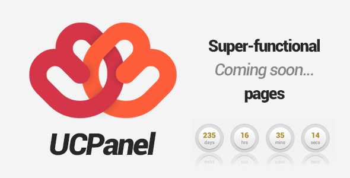
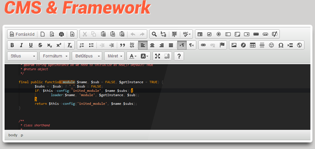
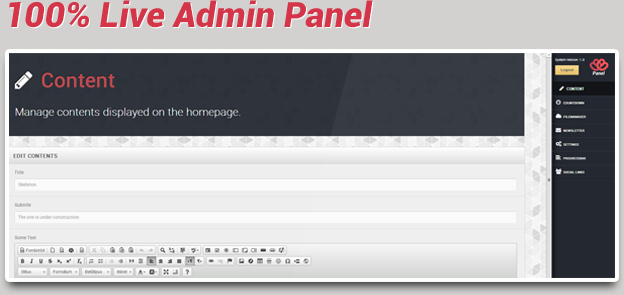
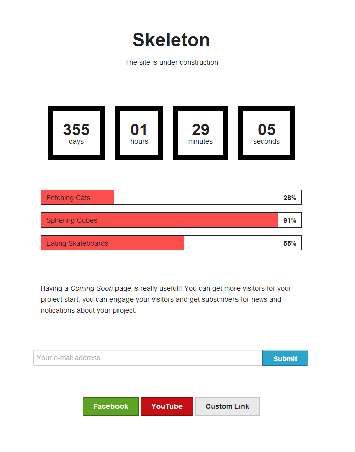
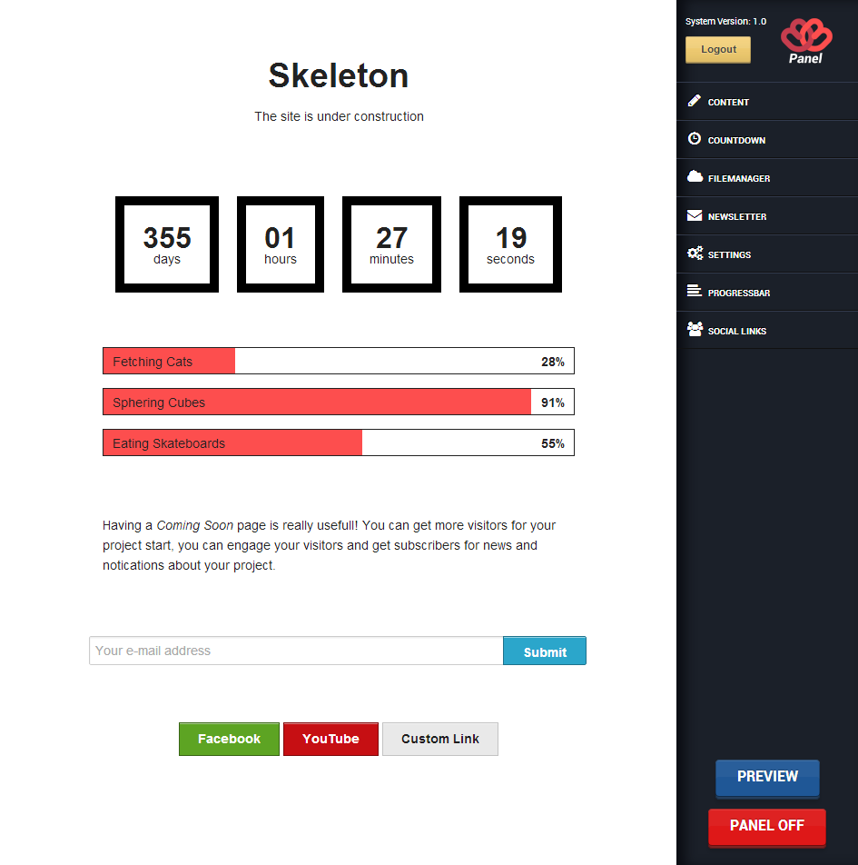
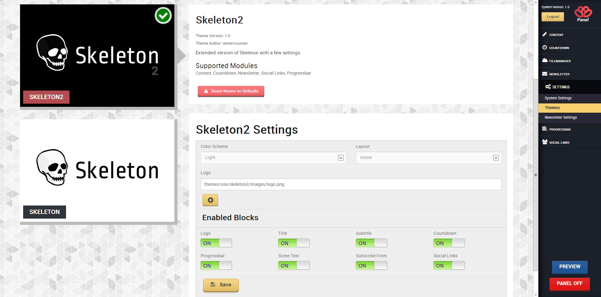

# Warning

This repository is not maintained, it is only here for historical reasons. It was originally sold on CodeCanyon.

# UCPanel - Custom PHP Framework for under construction pages - 2012

<h3>Description</h3>
<strong>UCPanel</strong> is a CodeCanyon exclusive, easy to use system to create functional <em>„Under Construction&#8221;</em> / <em>„Coming Soon&#8230;&#8221;</em> pages. Have you ever bought an UC template without functionality? It&#8217;s over, UCPanel has all the features (and more) which a common UC template needs to have. It has been built to make your life easier when creating UC pages.

The system is both a <strong>CMS</strong> and <strong>Framework</strong> so it&#8217;s suitable for both end-users and developers. Comes with a simple <strong>PHP API</strong> for the backend to develope modules and a <strong>JavaScript API</strong> to interact with the Admin Interface.

See your changes <strong>on-the-fly</strong>! No need to refresh your browser or another tab to view your changes, you can see it immediately after saving. The Admin Panel uses AJAX for every request.

<strong>Themeable.</strong> UCPanel supports multiple themes which can be easily changed any time on the admin panel to another one. The package comes with two example themes which are ideal to start to code your own theme. These themes are based on Foundation by Zurb.

<strong>Modular.</strong> The system supports modules (plugins, not mather what you call them) which can easily extend the feature of UCPanel.

<strong>Translatable.</strong> We are using language files, so you can easily translate the admin panel to your own language, maybe your client doesn&#8217;t english.

    <strong>No MySQL</strong> at all! You don&#8217;t need to setup any kind of database. UCPanel uses SQLite which will create a database automaticly for you. Just upload the script, open your page, do the <strong>1 step</strong> installation wizard and you&#8217;re on the go.

<ul>
    <li>100% Live Preview</li>
    <li>Out of the Box</li>
    <li>Very easy to use</li>
    <li>Content module</li>
    <li>Countdown module</li>
    <li>File-manager module</li>
    <li>Newsletter module</li>
    <li>Progressbar module</li>
    <li>Social links module</li>
</ul>

<ul>
<li>PHP API to develop modules</li>
<li>JavaScript API to interact with Admin panel</li>
<li>Extendable admin panel</li>
<li>RainTPL PHP template engine (both user/admin side)</li>
<li>EzSQL Database Abstraction Layer</li>
<li>SQLite PDO</li>
<li>Custom template functions</li>
<li>Language files</li>
</ul>

